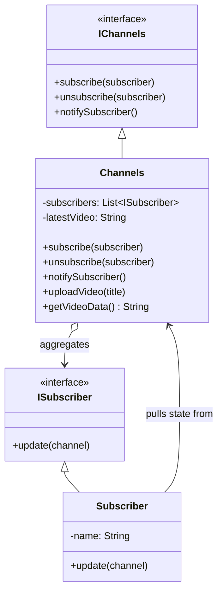

# Summary: Observer Design Pattern

## About
The **Observer Pattern** is a Behavioral Design Pattern that defines a one-to-many dependency between objects so that when one object (the **Subject** or **Publisher**) changes state, all its dependents (**Observers** or **Subscribers**) are notified and updated automatically.

It is the core architectural foundation of event-driven programming, reactive frameworks, and pub-sub systems.

---

## UML Diagram


---

## Tradeoffs: Pros and Cons

### Pros:
- **Loose Coupling:** The publisher does not need to know the concrete classes of the subscribers. It only interacts with them via a common `ISubscriber` interface.
- **Open/Closed Principle:** You can introduce new subscriber types (e.g., email notification, push notification, analytics tracking) without modifying the publisher code.
- **Dynamic Relations:** Subscriptions can be established, modified, or canceled dynamically at runtime.

### Cons:
- **Memory Leaks (Lapsed Listener Problem):** In languages with garbage collection like JS (V8), if a subscriber is no longer needed but fails to `unsubscribe()`, the publisher will maintain a reference to it. This prevents the subscriber from being garbage-collected, leading to memory leaks.
- **Random Notification Order:** Subscribers are notified in subscription order (typically), which can create race conditions if subscribers make state changes that depend on each other.
- **Event Loop Blocking (Node.js specific):** If a subject has 10,000 subscribers, calling a state change will synchronously trigger 10,000 `update()` invocations, blocking the single-threaded Node.js event loop.

---

## Push vs. Pull Model Tradeoffs

| Feature | Push Model | Pull Model |
| :--- | :--- | :--- |
| **Concept** | Subject sends raw data payload to observer: `update(data)` | Subject sends reference to itself: `update(this)` |
| **Decoupling** | **High.** Observer doesn't need to know the subject's structure or methods. | **Low.** Observer must know the subject's API methods to query state. |
| **Flexibility** | **Low.** Observers are restricted to whatever parameters the subject decides to push. | **High.** Observers can fetch precisely what they need from the subject. |
| **Reuse** | Easier to reuse observer classes across different publishers. | Observer is tied to a specific subject interface. |

---

## My Notes
1. **Node.js Native Implementation:** Node's native `EventEmitter` is an implementation of the Observer pattern. For example:
   ```javascript
   const EventEmitter = require('events');
   class MyEmitter extends EventEmitter {}
   ```
2. **Automatic Encapsulation:** Always trigger notifications internally within state-mutating methods (like `uploadVideo`) rather than relying on the client to call `notifySubscriber()` manually.
3. **Prevent Event Loop Jams:** In high-throughput Node.js microservices, consider deferring heavy notification processing using `setImmediate()` or `process.nextTick()` to avoid blocking the event loop:
   ```javascript
   notifySubscriber() {
       for (const sub of this.subscribers) {
           setImmediate(() => sub.update(this));
       }
   }
   ```

---

## Resources
- [YouTube Video Link](https://www.youtube.com/watch?v=vNSRcegCO8E)
- [Refactoring.guru: Observer Design Pattern](https://refactoring.guru/design-patterns/observer)

## Examples Solved
- `index.js`: YouTube channel subscription system refactored to support dynamic multi-channel subscriptions using the Pull model and self-notifying state transitions.
