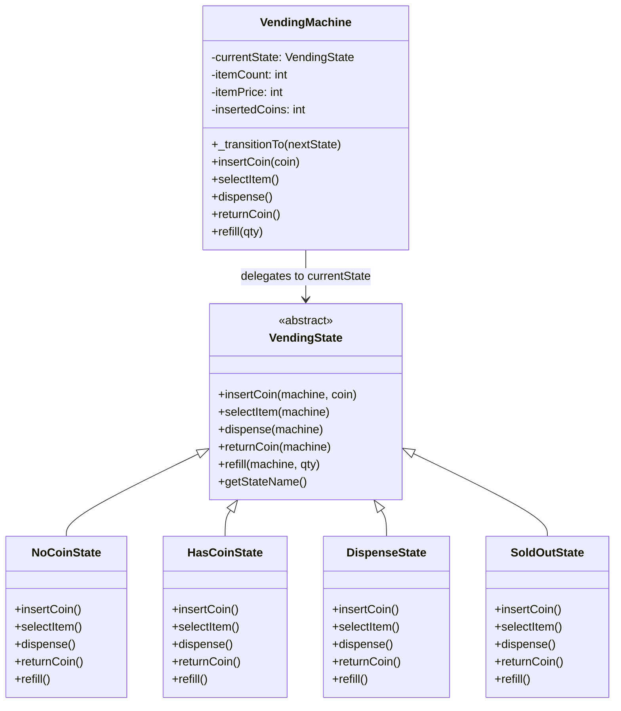

# Summary: State Design Pattern

## About
The **State Pattern** is a Behavioral Design Pattern that allows an object to alter its behavior when its internal state changes. The object will appear to change its class.

Rather than cluttering the Context class with massive conditional trees (e.g., `switch` statements checking status flags), behaviors are encapsulated into standalone state objects. The Context delegates state-specific operations to the current state object.

---

## UML Diagram


---

## Tradeoffs: Pros and Cons

### Pros:
- **Single Responsibility Principle:** Organizes all code related to a particular state into a single, cohesive class.
- **Open/Closed Principle:** New states (e.g., `MaintenanceState`, `OutOfOrderState`) can be introduced without modifying existing state classes or context code.
- **Simplifies Context Code:** Eliminates complex, sprawling conditional branches (like checking `state` variables inside every action method).
- **Explicit Transitions:** Clarifies state transitions by turning abstract state statuses into concrete object instances.

### Cons:
- **Class Explosion:** Can be excessive overhead for simple state machines with few states or limited transitions, creating unnecessary boilerplate.
- **Inter-State Coupling:** Concrete state subclasses must frequently refer to other state subclasses to trigger transitions, creating a tight structural dependency between state implementations.
- **Debugging Complexity:** Following the execution flow can be harder as actions dynamically switch objects at runtime.

---

## State vs. Strategy Pattern

| Feature | State Pattern | Strategy Pattern |
| :--- | :--- | :--- |
| **Primary Goal** | Manage behavior dynamically depending on internal status changes. | Configure an object's behavior by injecting interchangeable algorithms. |
| **Object Awareness** | States know about other states and actively trigger transitions. | Strategies are independent, isolated, and unaware of other strategies. |
| **Client Control** | Transitions occur automatically within the State/Context lifecycle. | The client explicitly chooses and injects the desired strategy at startup. |

---

## My Notes
1. **Encapsulation & Auto-Transitions:** In high-quality LLD, avoid exposing internal intermediate states to the client. For example, instead of forcing the client to manually invoke `machine.dispense()` after `selectItem()`, the context (`VendingMachine`) should detect the transition to `DispenseState` and automatically execute `dispense()` internally.
2. **Transition Guards:** JS/Node is dynamically typed, so missing return statements in states will evaluate to `undefined`, breaking the state machine. Enforce robustness by routing all state updates through an internal transition validation method:
   ```javascript
   _transitionTo(nextState) {
       if (!nextState || !(nextState instanceof VendingState)) {
           console.error("Transition Error: Invalid state. Staying in current state.");
           return;
       }
       this.currentState = nextState;
   }
   ```

---

## Resources
- [YouTube Video Link](https://www.youtube.com/watch?v=bJPmvie_p4w)
- [Refactoring.guru: State Design Pattern](https://refactoring.guru/design-patterns/state)

## Examples Solved
- `index.js`: Vending machine simulation displaying transition handling across `NO_COIN`, `HAS_COIN`, `DISPENSING`, and `SOLD_OUT` states.
