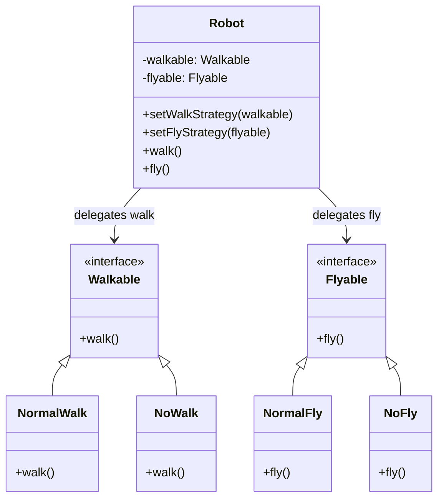

# Summary: Strategy Design Pattern

## About
The **Strategy Pattern** is a Behavioral Design Pattern that defines a family of algorithms, encapsulates each one, and makes them interchangeable. Strategy lets the algorithm vary independently from clients that use it.

Rather than implementing multiple versions of an algorithm within a single class (often resulting in sprawling conditional branches), or relying on inheritance (which leads to subclass explosion), the Strategy pattern delegates algorithmic behaviors to separate, composed objects.

---

## UML Diagram

---

## Tradeoffs: Pros and Cons

### Pros:
- **Runtime Swappability:** Algorithms can be dynamically swapped at runtime via setter methods (e.g., swapping a robot's walk strategy to `NoWalk` when its battery level is depleted).
- **Open/Closed Principle:** You can introduce new strategies (e.g., `FastRun`, `Teleport`) without modifying the `Robot` context or other existing strategies.
- **Elimination of Conditionals:** Replaces complex, branching conditional statements (like `if-else` or `switch` selectors) with clean polymorphism.
- **Composition over Inheritance:** Decouples behaviors, avoiding rigid subclass structures (e.g., avoiding classes like `WalkingNonFlyingRobot` vs. `WalkingFlyingRobot`).

### Cons:
- **Increased Class Count:** Increases the overall number of classes/files, adding code boilerplate for simple algorithms.
- **Client Complexity:** Clients must be aware of the differences between strategies to select and configure the correct one.
- **Memory Overhead:** Instantiating strategies for every context can increase memory usage (though stateless strategies can be optimized using the Flyweight pattern).

---

## Strategy vs. State Pattern

| Feature | Strategy Pattern | State Pattern |
| :--- | :--- | :--- |
| **Intent** | Configure an object's behavior by injecting interchangeable algorithms. | Change an object's behavior dynamically based on its internal state. |
| **Awareness** | Strategies are independent and generally unaware of other strategies. | Concrete States are usually aware of other states and trigger transitions between them. |
| **Control** | Typically, the client selects and injects the desired strategy. | Transitions are handled automatically by the Context or the State objects. |

---

## My Notes
1. **The Comma Operator Gotcha:** Inside JS constructors, ensure statements are separated by semicolons (`;`) or newlines. Separating them with commas is valid (evaluated as a single comma-operator expression) but acts as a syntax code smell that can disrupt parsing.
2. **Context Passing:** If a strategy needs contextual data to calculate its algorithm, you can either pass parameters directly to the strategy method (e.g., `walk(speed)`) or pass the entire context object (e.g., `walk(this)` / Pull model).

---

## Resources
- [YouTube Video Link](https://www.youtube.com/watch?v=PpKvPrl_gRg)
- [Refactoring.guru: Strategy Design Pattern](https://refactoring.guru/design-patterns/strategy)

## Examples Solved
- `index.js`: Simulates a robot with configurable and runtime-swappable walking and flying behaviors.
