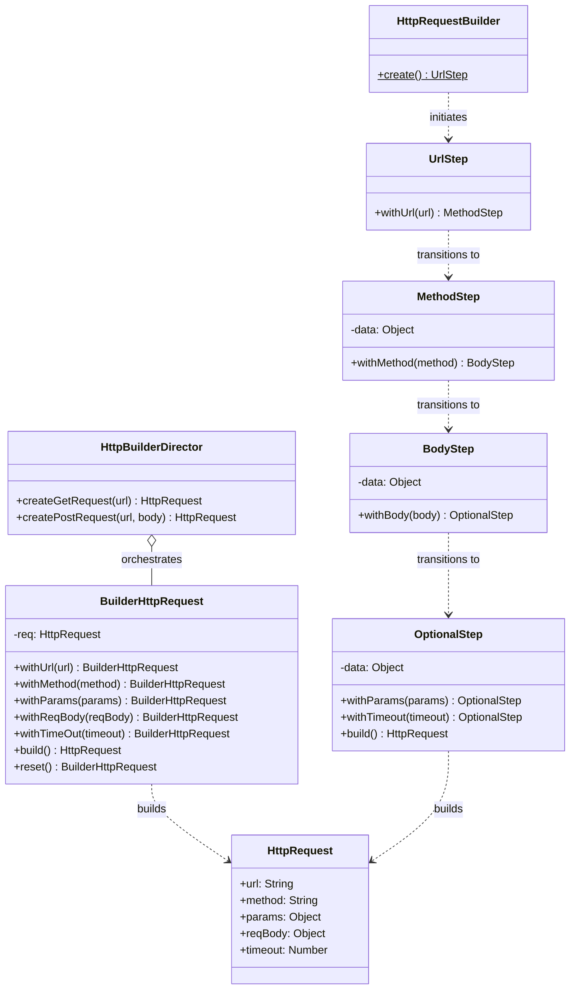

# Summary: Builder Pattern

## About
The Builder pattern is a creational design pattern that lets you construct complex objects step by step. The pattern allows you to produce different types and representations of an object using the same construction code.

### Key Components
1. **Builder**: Interface/Base class defining the steps to build the product.
2. **Concrete Builder**: Implements the steps and keeps track of the resulting product.
3. **Product**: The complex object being built.
4. **Director**: (Optional) Orchestrates the builder to create standard "templates" or pre-configured products.
5. **Step Builder**: (Advanced) Enforces a strict sequence of construction steps through interface/object chaining.

---

## UML Diagram

---

## Tradeoffs

| Feature | Pros | Cons |
| :--- | :--- | :--- |
| **Basic Builder** | Clean code, fluent interface, easy to add optional params. | Can lead to "incomplete" objects if mandatory params aren't checked. |
| **Director** | Encapsulates common configurations; hides building complexity from the client. | Adds another layer; can become bloated if too many templates exist. |
| **Step Builder** | **Type-safe** construction; enforces mandatory fields in a specific order. | Very rigid; difficult to handle branching logic or skip optional steps. |

## Resources
- [Refactoring Guru - Builder](https://refactoring.guru/design-patterns/builder)
- [SourceMaking - Builder](https://sourcemaking.com/design_patterns/builder)
- [Youtube - Design Patterns Builder](https://www.youtube.com/watch?v=G4Ntl9KzIxY)

## My Notes
- Use a **Fluent Interface** (`return this`) for better readability.
- Perform **Validation** in the `build()` method to ensure the product is in a consistent state.
- **Director vs Step Builder**: Use a Director for *pre-set configurations*; use a Step Builder for *guaranteed construction order*.
- Prefer collecting attributes in the builder and instantiating the product at the end to avoid state leakage (State Contamination).

## Examples Solved
- `HttpRequestBuilder`: Constructing a network request with optional parameters.
- `HttpBuilderDirector`: Orchestrating GET/POST templates.
- `StepwiseHttpRequestBuilder`: Enforcing `URL -> Method -> Body` sequence.
