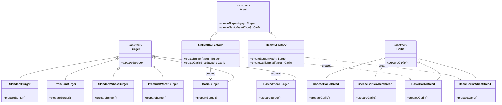

# Summary: Factory Patterns

## About
Factory patterns are creational patterns that provide an interface for creating objects in a superclass, but allow subclasses to alter the type of objects that will be created.

### 1. Simple Factory
A simple class that handles the creation logic for multiple types of objects based on a parameter. 
- **Pros**: Encapsulates creation logic.
- **Cons**: Violates Open/Closed Principle (OCP) because the factory must be modified for every new product type.

### 2. Factory Method
Defines an interface for creating an object, but lets subclasses decide which class to instantiate.
- **Pros**: Follows OCP. Decouples creator from concrete products.
- **Cons**: Can lead to many subclasses for each product type (Class Explosion).

### 3. Abstract Factory
Provides an interface for creating families of related or dependent objects without specifying their concrete classes.
- **Pros**: Ensures product consistency (families work together). Decouples client code from concrete implementations.
- **Cons**: Adding a new product type to the family requires changing the interface and all concrete factories.

---

## UML Diagram

---

## Tradeoffs

| Pattern | Use Case | Flexibility | Complexity |
| :--- | :--- | :--- | :--- |
| **Simple Factory** | Small apps with few, stable types. | Low | Low |
| **Factory Method** | When you want to delegate product creation to subclasses. | Medium | Medium |
| **Abstract Factory** | When you have "families" of products that must be used together. | High | High |

## Resources
- [Refactoring Guru - Factory Method](https://refactoring.guru/design-patterns/factory-method)
- [Refactoring Guru - Abstract Factory](https://refactoring.guru/design-patterns/abstract-factory)

## Examples Solved
- Burger Shop (Progression from Simple -> Method -> Abstract)
