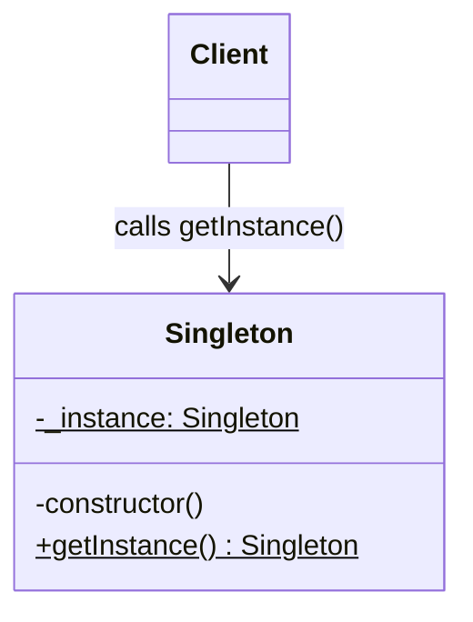

# Singleton Pattern Summary

## About
**Singleton** is a Creational Design Pattern that guarantees a class has exactly one instance and provides a global point of access to it.

In Node.js backend development, this is most commonly used for:
- Database connection pools
- Caching services (like a Redis client)
- Global application configuration loaders

### 3 Ways to Create a Singleton in Node.js

#### 1. Basic Approach (Lazy)
Manually protect against the `new` keyword by throwing an Error in the constructor if the instance already exists. Rely exclusively on a `getInstance()` public static method.
- **Pros:** Does not consume memory or boot time until the object is explicitly called for the first time.
- **Cons:** Requires manual boilerplate to protect the constructor. Not natively safe if expanded to async operations without Promise-locking.

#### 2. Async "Thread" Safe (Lazy)
Create the DB connection asynchronously only when requested. Use an `initializing` Promise to literally freeze simultaneous concurrent requests ensuring the database isn't instantiated twice by the Node event loop.
- **Pros:** Perfectly tailored for real-world backend applications (like DB/Redis connections). Strictly prevents async double-instantiation race conditions.
- **Cons:** Slightly more complex codebase. Introduces minor `Promise` overhead on the first few ticks.

#### 3. Eager Loading
Heavily relies on Node's native module caching. You just initialize the object inside the file and `export default instance`.
- **Pros:** Zero boilerplate logic (no `getInstance()` needed). Incredibly fast, clean, and 100% protected by Node's native `require`/`import` caching system.
- **Cons:** Instantiates the object synchronously during app boot, consuming memory immediately even if it's never used. **Fatal** if the class requires asynchronous environment variables (e.g. AWS Secret fetched over network) before booting.

## UML Diagram

*(Note: In UML, `$` denotes static fields/methods. A typical Singleton makes its constructor private and exposes a static accessor).*

## Resources
- [YouTube Video Link](https://www.youtube.com/watch?v=CD3meit-WDc)
- [Refactoring.guru Documentation](https://refactoring.guru/design-patterns/singleton)

## My Notes
- **Fatal Typos:** Need to be extremely careful with variable naming (`_instance` vs `__instance`). If the constructor sets a different property than what `getInstance()` protects, the Singleton breaks and multiple objects spawn natively bypassing checks.
- **Eager vs Lazy Tradeoff:** 
  - **Eager** loads synchronously. If you need to asynchronously fetch environment variables (like a DB password), Eager will crash or pass `undefined`. 
  - **Lazy Loading** via Promises is much safer for backends doing heavy async initialization.

## Examples Solved
- `index.js`: We successfully implemented all 3 forms of Singleton: Basic (with `throw new Error` protection), Async Race-Safe (using frozen Promises), and Eager (Node module export).
