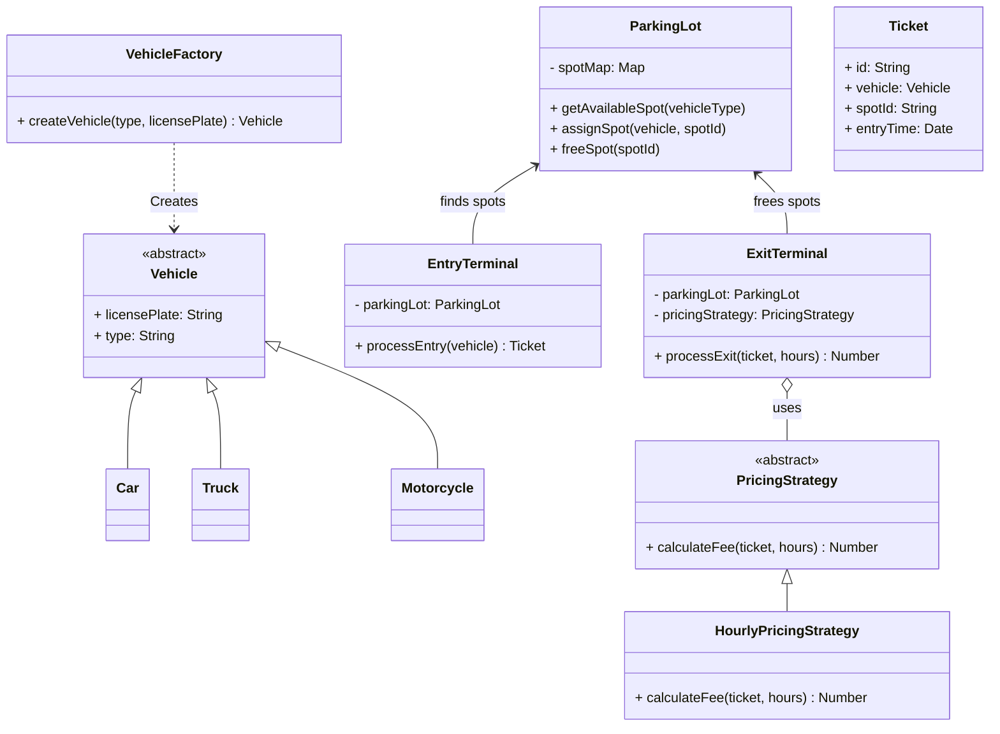

# Parking Lot System Architecture

```mermaid
classDiagram
    class ParkingLot {
        - spotMap: Map
        + getAvailableSpot(vehicleType)
        + assignSpot(vehicle, spotId)
        + freeSpot(spotId)
    }

    class VehicleFactory {
        + createVehicle(type, licensePlate) Vehicle
    }

    class Vehicle {
        <<abstract>>
        + licensePlate: String
        + type: String
    }
    class Car
    class Truck
    class Motorcycle
    Vehicle <|-- Car
    Vehicle <|-- Truck
    Vehicle <|-- Motorcycle
    VehicleFactory ..> Vehicle : Creates

    class PricingStrategy {
        <<abstract>>
        + calculateFee(ticket, hours) Number
    }
    class HourlyPricingStrategy {
        + calculateFee(ticket, hours) Number
    }
    PricingStrategy <|-- HourlyPricingStrategy

    class Ticket {
        + id: String
        + vehicle: Vehicle
        + spotId: String
        + entryTime: Date
    }

    class EntryTerminal {
        - parkingLot: ParkingLot
        + processEntry(vehicle) Ticket
    }
    
    class ExitTerminal {
        - parkingLot: ParkingLot
        - pricingStrategy: PricingStrategy
        + processExit(ticket, hours) Number
    }

    ParkingLot <-- EntryTerminal : finds spots
    ParkingLot <-- ExitTerminal : frees spots
    ExitTerminal o-- PricingStrategy : uses
```
