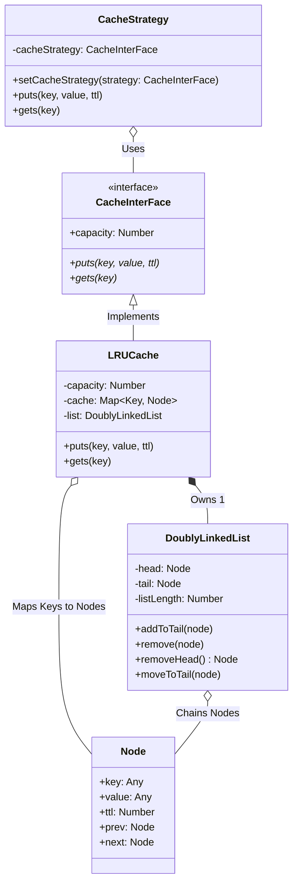

# LRU Cache Architecture Diagram

This diagram visualizes your exact implementation for Problem 9, including the Strategy Pattern for the cache wrapper and the underlying Map + Doubly Linked List combination for `O(1)` operations.

