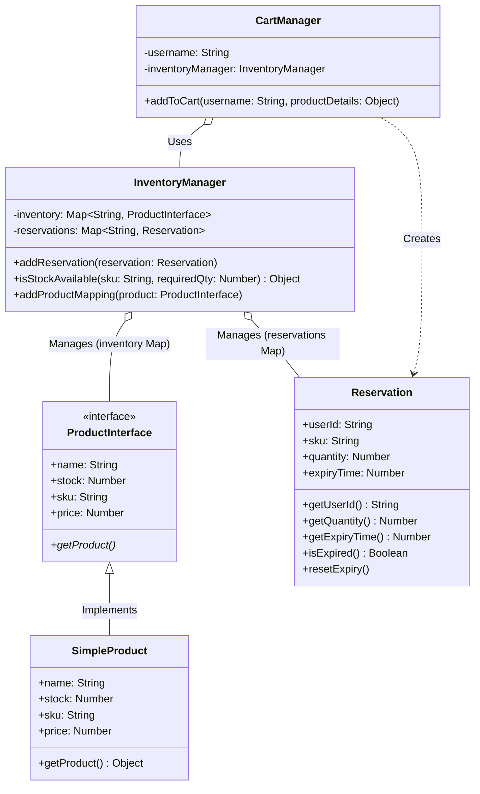

# E-Commerce Inventory Manager Architecture Diagram

This diagram visualizes your exact implementation for Problem 10, highlighting the decoupling of the `Product` data model from the `InventoryManager` state logic, and showing how the `CartManager` interacts with the system to create temporary `Reservation` objects.

