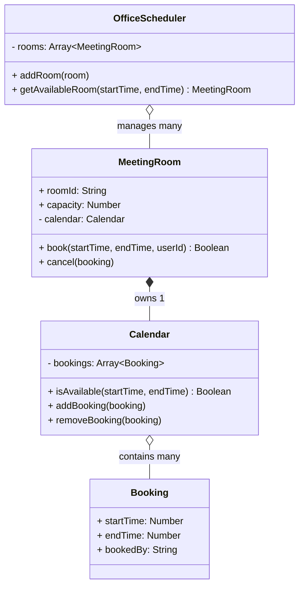

# Meeting Room Scheduler Architecture

This diagram reflects our Phase 2 discussion on how to handle the state in-memory without a database.

```mermaid
classDiagram
    class Booking {
        + startTime: Number
        + endTime: Number
        + bookedBy: String
    }
    
    class Calendar {
        - bookings: Array~Booking~
        + isAvailable(startTime, endTime) Boolean
        + addBooking(booking)
        + removeBooking(booking)
    }
    
    class MeetingRoom {
        + roomId: String
        + capacity: Number
        - calendar: Calendar
        + book(startTime, endTime, userId) Boolean
        + cancel(booking)
    }
    
    class OfficeScheduler {
        - rooms: Array~MeetingRoom~
        + addRoom(room)
        + getAvailableRoom(startTime, endTime) MeetingRoom
    }
    
    MeetingRoom *-- Calendar : owns 1
    Calendar o-- Booking : contains many
    OfficeScheduler o-- MeetingRoom : manages many
```
