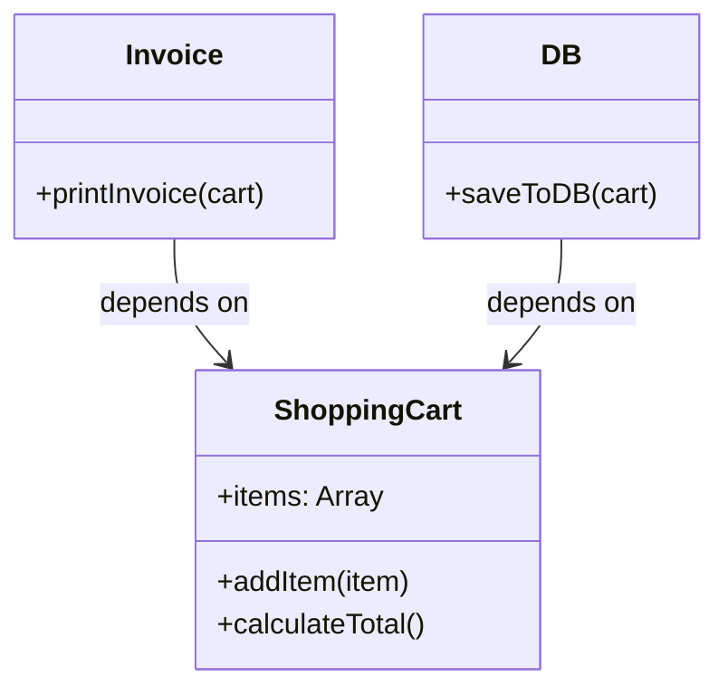
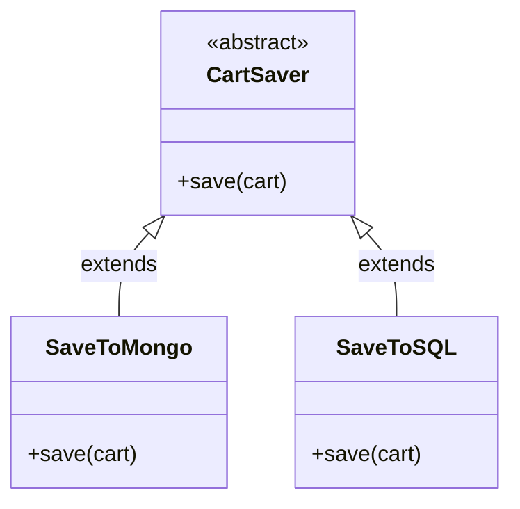
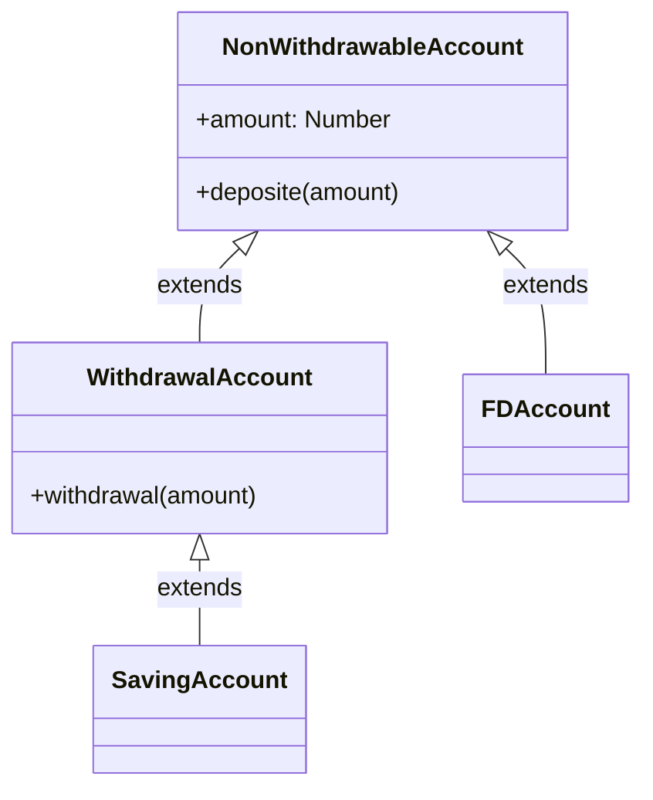
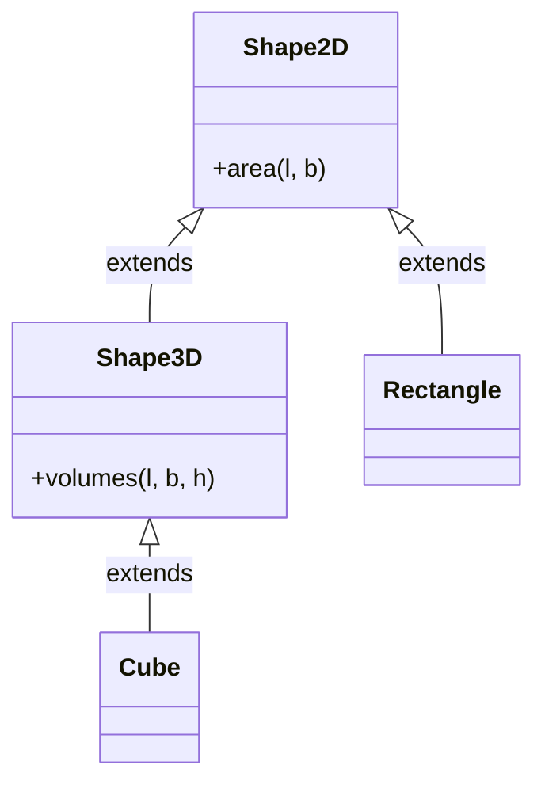
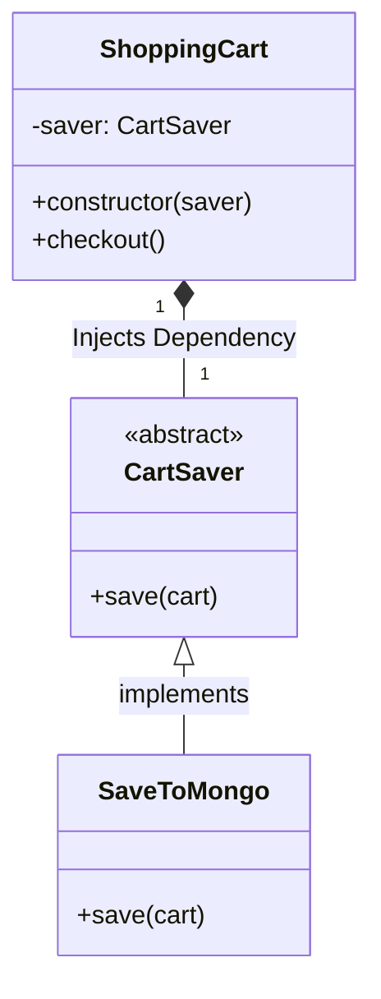

# SOLID Principles Summary

SOLID is an acronym for the first five object-oriented design (OOD) principles by Robert C. Martin (also known as Uncle Bob). These principles help make software architectures more understandable, flexible, and maintainable.

---

## 1. Single-responsibility Principle (SRP)
**Theory:** A class should have one, and only one, reason to change. It should encapsulate a single responsibility or a single piece of business logic. If a class has multiple responsibilities, they become coupled, meaning a change in one responsibility might break the others.

**Example from our Code (`SRP.js`):**
Instead of the `ShoppingCart` holding the items, calculating the total, printing the invoice, and saving to the database, we split it into three separate classes:
- `ShoppingCart`: Manages items and totals.
- `Invoice`: Prints the data.
- `DB`: Handles persistence.

**UML Diagram:**

---

## 2. Open-closed Principle (OCP)
**Theory:** Software entities (classes, modules, functions, etc.) should be open for extension, but closed for modification. You should be able to add new functionality without touching existing code structure.

**Example from our Code (`OCP.js`):**
Instead of writing an `if/else` block inside a `saveToDB(type)` method to check for "mongo", "sql", etc., we created a base class `CartSaver`. We extend it to `SaveToMongo` and `SaveToSQL`. If we need Redis later, we just create `SaveToRedis` without modifying existing classes.

**UML Diagram:**

---

## 3. Liskov Substitution Principle (LSP)
**Theory:** Objects of a superclass should be replaceable with objects of a subclass without affecting the correctness of the program. A subclass must not break the expectations set by its parent.
1. **Signature Rule:** Methods arguments and return types should be consistent.
   1.1. **Exception Rule:** Subclasses should not throw new, unexpected exceptions.
2. **Property Rule:** Subclasses should not implicitly break properties of the superclass.
3. **Method Rule:** Pre-conditions cannot be strengthened, and post-conditions cannot be weakened.

**Example from our Code (`LSP.js`):**
A Fixed Deposit (`FDAccount`) cannot be withdrawn from. If it inherits a `withdrawal()` method from `BankAccount` and throws an error, it violates LSP. We fixed this by creating `NonWithdrawableAccount` and a subclass `WithdrawalAccount` which added the withdrawal context cleanly.

**UML Diagram:**

---

## 4. Interface Segregation Principle (ISP)
**Theory:** Clients should not be forced to depend upon interfaces that they do not use. Fat interfaces should be broken down into smaller, highly cohesive interfaces.

**Example from our Code (`ISP.js`):**
Instead of a single `AreaAndVolumes` class forcing a 2D `Square` to implement a `volumes()` method that it doesn't need, we split it into `Shape2D` and `Shape3D`. A `Cube` naturally extends `Shape3D` (which inherits `Shape2D`), ensuring every class only gets the methods it explicitly can use.

**UML Diagram:**

---

## 5. Dependency Inversion Principle (DIP)
**Theory:** 
1. High-level modules should not depend on low-level modules. Both should depend on abstractions.
2. Abstractions should not depend on details. Details should depend on abstractions.

**Example from our Code (`DIP.js`):**
Our high-level `ShoppingCart` shouldn't instantiate `new SaveToMongo()` directly inside its constructor. That welds them together. By passing the saver via `constructor(saver)`, we injected the dependency. Both `ShoppingCart` and the database class now depend on the shared `CartSaver` abstraction.

**UML Diagram:**

---

## Resources
- [SOLID Principles Video](https://www.youtube.com/watch?v=UsNl8kcU4UA&t=248s)
- [DigitalOcean Conceptual Guide](https://www.digitalocean.com/community/conceptual-articles/s-o-l-i-d-the-first-five-principles-of-object-oriented-design)

## Examples Solved
- `SRP.js`: Shopping Cart separated from Invoice and DB.
- `OCP.js`: `CartSaver` extended to avoid `if/else` checks for DB types.
- `LSP.js`: Prevented `FDAccount` from inheriting `withdrawal()` logic and throwing errors.
- `ISP.js`: Segregated 2D Area logic from 3D Volume logic.
- `DIP.js`: Constructor Dependency Injection (`CartSaver`) into `ShoppingCart`.
