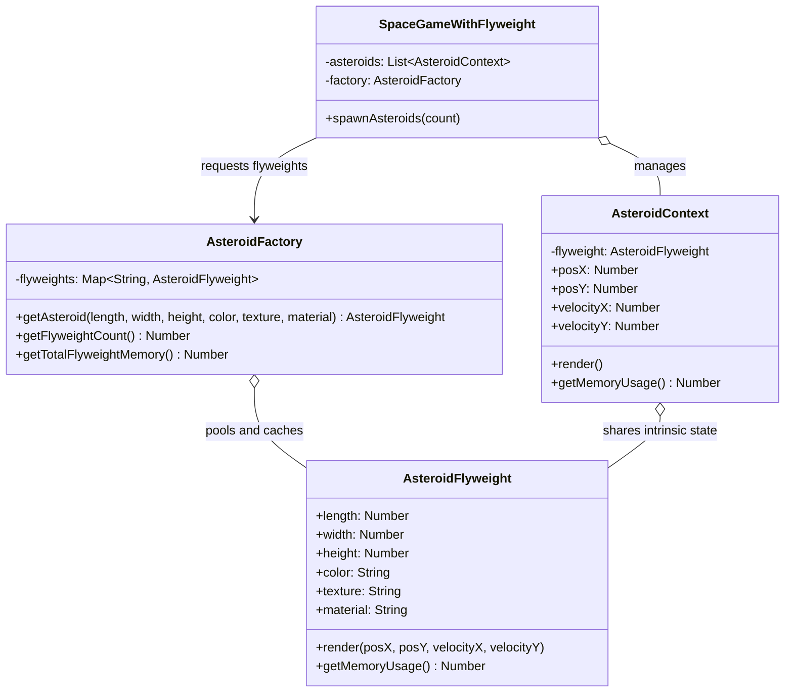

# Summary: Flyweight Design Pattern

## About
The **Flyweight Pattern** is a Structural Design Pattern that minimizes memory usage by sharing as much data as possible with similar objects. It is particularly valuable when rendering or managing massive quantities of objects (such as particles, game sprites, or text characters).

The pattern divides an object's state into two distinct categories:
1. **Intrinsic State**: Constant, invariant data that is shared across many objects and can be stored in the flyweight (e.g., shape, color, texture, material). Intrinsic state should be immutable (`Object.freeze`).
2. **Extrinsic State**: Context-dependent data that varies per instance and cannot be shared (e.g., coordinates, velocity, unique IDs). This is passed into the flyweight's methods or stored in lightweight context objects.

---

## UML Diagram

---

## Tradeoffs: Pros and Cons

### Pros:
- **Massive RAM Savings:** Drastically reduces memory consumption when managing thousands or millions of objects by reusing intrinsic state.
- **Garbage Collection Optimization:** Significantly fewer object allocations mean less GC pressure and smoother framerates in real-time systems.

### Cons:
- **CPU vs Memory Tradeoff:** Looking up shared flyweights or calculating extrinsic state at runtime trades CPU cycles for memory savings.
- **Code Complexity:** Complicates code architecture by splitting unified classes into Flyweights, Contexts, and Factories.

---

## Resources
- [YouTube Video Link](https://www.youtube.com/watch?v=vNSRcegCO8E)
- [Refactoring Guru - Flyweight](https://refactoring.guru/design-patterns/flyweight)

---

## My Notes
- **Immutability is Crucial:** The intrinsic state inside a flyweight MUST be immutable (`Object.freeze(this)`). If one client mutates shared state, all other objects sharing that flyweight are silently corrupted.
- **Factory Key Optimization:** Use a composite string key (e.g., `${color}_${texture}_${material}`) in `AsteroidFactory` to quickly retrieve existing flyweights in $O(1)$ time.

---

## Examples Solved
- `WithoutFlyWeight.js` vs `WithFlyWeight.js`: Simulates spawning 100,000 asteroids in space. Demonstrated how separating intrinsic state (`AsteroidFlyweight`) from extrinsic coordinates (`AsteroidContext`) reduces memory consumption by over 70%.
