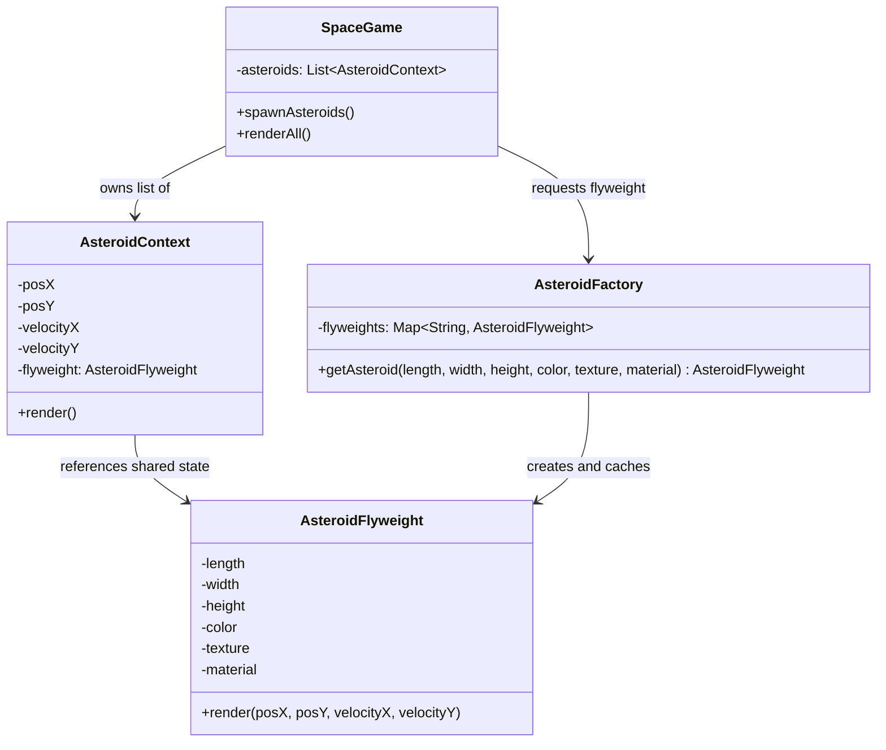

# Summary: Flyweight Design Pattern

## About
**Flyweight** is a Structural Design Pattern that enables fitting more objects into the available amount of RAM by sharing common parts of state between multiple objects instead of keeping all of the data in each individual object.

It divides the state of an object into two parts:
1. **Intrinsic State:** Constant/invariant data that remains identical across multiple objects (e.g., color, texture, base dimensions). This is shared and stored in the Flyweight object.
2. **Extrinsic State:** Variable/variant data that is unique to each individual instance and depends on context (e.g., coordinates, velocity, unique IDs). This is kept in the Context object.

---

## UML Diagram

---

## Tradeoffs: Pros and Cons

### Pros:
- **Massive RAM Savings:** If your system allocates millions of objects (like catalog items, graphics particles, or open user connection metadata), it prevents heap exhaustion.
- **Garbage Collection Optimization:** Fewer objects on the heap means the Garbage Collector (GC) runs less frequently and with shorter pause times, stabilizing latency.
- **Centralized Shared Properties:** Changing or loading shared metadata is handled in one place (the Factory Cache).

### Cons:
- **CPU vs RAM Tradeoff:** You save memory but consume more CPU cycles. Reconstructing or passing the extrinsic state on the fly for every method call (e.g., `render(posX, posY)`) adds runtime invocation overhead.
- **Complex Code Architecture:** Introduces significant code complexity (segregating classes, managing a caching factory, and introducing context wrappers).
- **Mutability Risks:** If any part of the system modifies a shared flyweight, it breaks every other context referencing it. This requires strict defensive immutability programming.

---

## My Notes
1. **JS Immutability:** Because JS objects are mutable by default, always call `Object.freeze(this)` inside the Flyweight constructor. This blocks catastrophic runtime state mutations.
2. **The JSON.stringify Trap:** In JavaScript, estimating object memory footprint using `JSON.stringify(this)` on a Context object will serialize the referenced flyweight as well, simulating higher memory use. To calculate simulated sizes correctly, exclude the flyweight from serialization and add a mock `8 bytes` pointer/reference size.
3. **E-commerce Applications:**
   - **Catalog System:** Share a single `ProductFlyweight` (Name, Description, Brand, Category, ImageURL) across millions of user session carts, storing only unique `quantity` and `price` (extrinsic) per line item.

---

## Resources
- [YouTube Video Link](https://www.youtube.com/watch?v=vNSRcegCO8E)
- [Refactoring.guru: Flyweight Design Pattern](https://refactoring.guru/design-patterns/flyweight)

## Examples Solved
- `WithoutFlyWeight.js`: Standard implementation creating independent, duplicate asteroid objects.
- `WithFlyWeight.js`: Refactored version using `AsteroidFlyweight` cache and immutable structures. Resulted in **44% memory savings** at 15 items, scaling to >50% at 10,000+ items.
